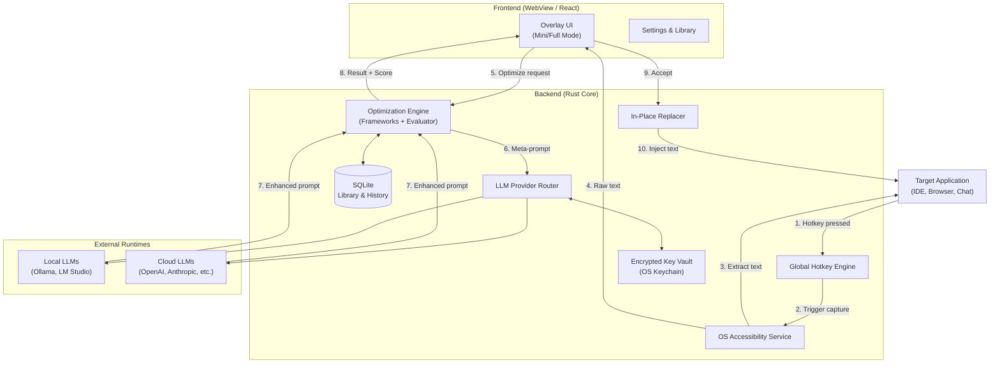

# System Architecture Design — PromptOpt Overlay

| Field | Value |
|-------|-------|
| **Document ID** | SAD-001 |
| **Version** | 1.0 |
| **Date** | 2026-06-17 |
| **Status** | Draft for Review |

---

## 1. Purpose & Scope

This document defines the system architecture for **PromptOpt Overlay**.
The application is a locally-installed, cross-platform desktop overlay that captures text from any active input field, optimizes it via local or cloud LLMs, and replaces it in-place.

### 1.1 Project Description

A locally-installed, cross-platform desktop application that overlays any active input field, captures a user's raw prompt on a configurable global hotkey, routes it to a user-selected local or cloud LLM for optimization, and pastes the enhanced prompt back in place of the original.

---

## 2. Architectural Style

The system adopts a **Tauri-based Hybrid Architecture**.
- **Core (Rust):** Handles OS-level integrations, global hotkeys, accessibility APIs, clipboard management, local SQLite, and secure key vaulting.
- **UI (WebView/React):** Renders the overlay, settings, and prompt library using web technologies for rapid, themeable UI development.

This approach minimizes memory footprint (<120MB idle) compared to Electron, while providing native-level OS access required for in-place text replacement.

### 2.1 High-Level Architecture Diagram

### 2.2 Architectural Principles

| # | Principle | Rationale |
|---|-----------|-----------|
| AP-1 | **Local-First** | All settings, history, and keys stay on device. Zero telemetry by default. |
| AP-2 | **Non-Activating Overlay** | The overlay must not steal focus from the target application. |
| AP-3 | **Graceful Degradation** | If native replacement fails, fall back to clipboard paste simulation. |
| AP-4 | **Provider Abstraction** | LLM providers are isolated behind a unified adapter trait. |
| AP-5 | **Framework as Data** | Optimization frameworks (APE, RACE, etc.) are Jinja/Mustache templates, not hardcoded logic. |

---

## 3. Technology Stack

| Category | Choice | Justification |
|----------|--------|---------------|
| App Framework | Tauri 2.0 | Smallest memory footprint, native Rust access for OS APIs. |
| Core Language | Rust 1.70+ | Memory safety, high performance, cross-platform OS bindings. |
| UI Framework | React 18 + TypeScript | Component-based UI, rapid theme development. |
| UI Styling | Tailwind CSS | Utility-first, highly themeable overlay. |
| Local Storage | SQLite (rusqlite) | Embedded, zero-config relational DB for prompt library. |
| Secrets | OS Keychain (keyring crate) | Secure, hardware-backed storage for API keys. |
| LLM Communication | reqwest + tokio | Async HTTP for streaming LLM responses. |

---

## 4. Architecture Decision Records (ADRs)

### ADR-001: Tauri over Electron

| Field | Value |
|-------|-------|
| **Status** | Accepted |
| **Date** | 2026-06-17 |
| **Context** | The app must run as a background overlay with <120MB idle RAM. Electron's baseline memory is too high for a utility app. |
| **Decision** | Use Tauri. The Rust backend handles heavy lifting (OS APIs, LLM streaming), while the WebView renders a lightweight React UI. |
| **Consequences** | Requires Rust expertise. OS accessibility APIs must be bridged via Rust. |

### ADR-002: OS Accessibility APIs for Text Replacement

| Field | Value |
|-------|-------|
| **Status** | Accepted |
| **Date** | 2026-06-17 |
| **Context** | Clipboard paste simulation (Cmd+V) is unreliable, loses undo history, and overwrites user's clipboard. |
| **Decision** | Use native Accessibility APIs (UIAutomation on Win, AXUIElement on Mac, AT-SPI on Linux) to `setText` or `setValue` directly on the focused element. |
| **Consequences** | Requires explicit accessibility permissions from the user. Fallback to clipboard is still needed for uncooperative apps (e.g., web SPAs). |

### ADR-003: Optimization Frameworks as Templates

| Field | Value |
|-------|-------|
| **Status** | Accepted |
| **Date** | 2026-06-17 |
| **Context** | Hardcoding frameworks like APE or CREATE makes them hard to edit or import. |
| **Decision** | Frameworks are stored as Jinja2/Mustache templates in SQLite. The Optimization Engine injects raw prompt and context into the template before sending to LLM. |
| **Consequences** | Allows user-created framework packs. Requires a safe template rendering engine in Rust. |

---

## 5. Quality Attributes

| Attribute | Target | Strategy |
|-----------|--------|----------|
| **Performance** | Overlay < 150ms, Local LLM < 3s | Rust core, non-activating window, async streaming. |
| **Reliability** | ≥90% Replacement Success | App-profile registry with per-app fallback strategies. |
| **Privacy** | Zero telemetry, Local-first | No outbound traffic except user-configured LLM endpoints. PII regex blocklist. |
| **Portability** | Win/Mac/Linux parity | Tauri abstracts windowing; Rust handles OS-specific accessibility modules behind a trait. |

---

## 6. Assumptions & Constraints

### 6.1 Assumptions

- User has administrative rights to grant accessibility permissions.

### 6.2 Constraints

- Requires explicit Accessibility/Input-Monitoring permissions on first launch.
- Cloud LLM routing requires user-provided API keys.
- Local LLMs must expose OpenAI-compatible or native REST endpoints on localhost.

---

*End of System Architecture Design.*
