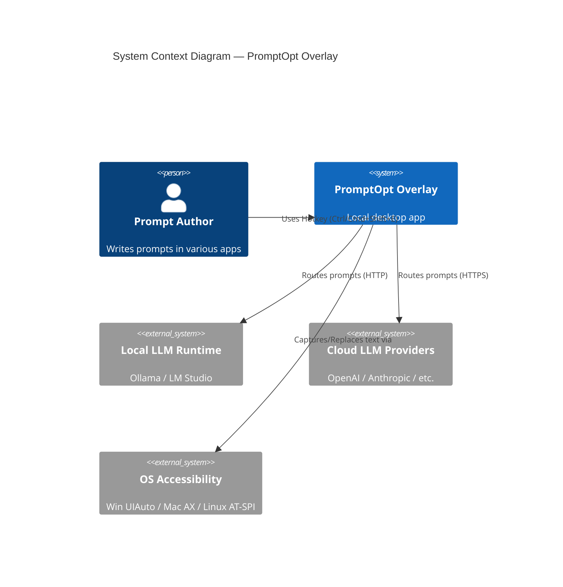
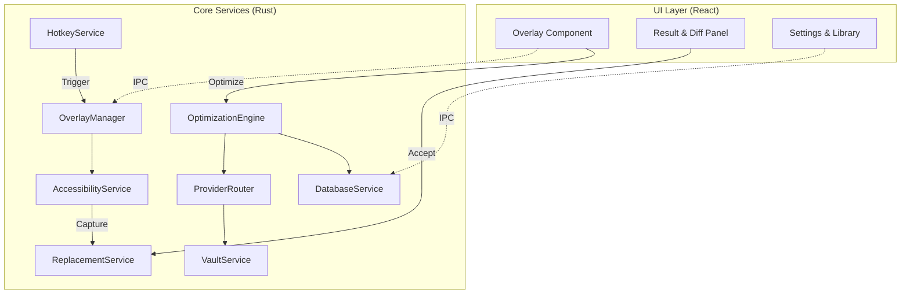
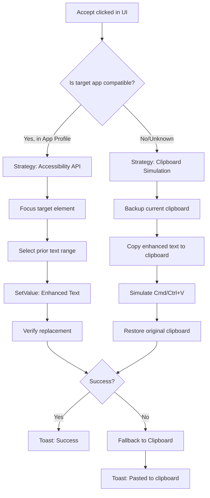
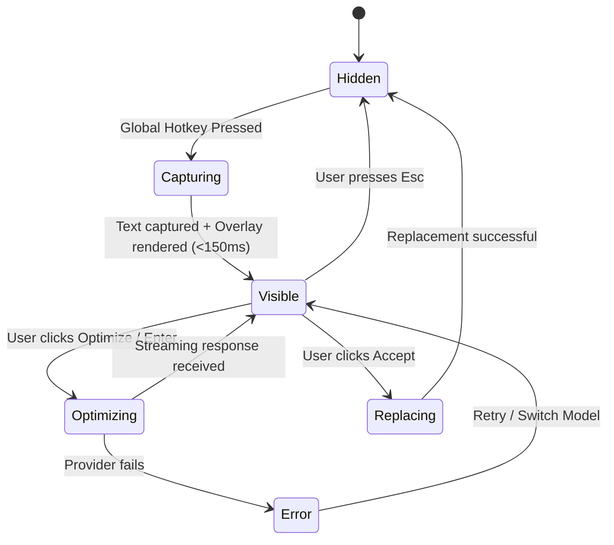

# High-Level Design — PromptOpt Overlay

| Field | Value |
|-------|-------|
| **Document ID** | HLD-001 |
| **Version** | 1.0 |
| **Date** | 2026-06-17 |
| **Status** | Draft for Review |

---

## 1. System Context



### 1.1 Actors

- End User (Primary): Content creator, marketer, developer
- LLM Provider Local (System): Ollama, LM Studio, llama.cpp
- LLM Provider Cloud (System): OpenAI, Anthropic, OpenRouter
- OS Accessibility Service (System): OS-level text-selection API

---

## 2. Component Diagram



### 2.1 Component Responsibilities

| Component | Language | Responsibility |
|-----------|----------|----------------|
| **HotkeyService** | Rust | Registers global shortcuts, detects conflicts. |
| **AccessibilityService** | Rust | Queries focused element, extracts text, injects text via OS APIs. |
| **OverlayManager** | Rust | Controls overlay window position (caret-aware), lifecycle, focus management. |
| **OptimizationEngine** | Rust | Applies Jinja templates, calls LLM, calculates diff, scores output. |
| **ProviderRouter** | Rust | Routes requests to correct LLM adapter based on rules (local vs cloud, latency). |
| **ReplacementService** | Rust | Manages the strategy pipeline: Accessibility -> Clipboard -> Synthetic Keys. |

---

## 3. Data Flow: Capture & Replace Pipeline

### 3.1 Text Capture Flow

```
1. User presses Hotkey (Ctrl/Cmd+Shift+E)
2. HotkeyService fires event to OverlayManager
3. OverlayManager calls AccessibilityService.getActiveFieldText()
4. AccessibilityService identifies focused UI element via OS API
5. Extracts selected text (or full field content if none selected)
6. OverlayManager shows Overlay window anchored to caret
7. Passes raw text to React UI via Tauri IPC
```

### 3.2 In-Place Replacement Flow



---

## 4. Overlay Lifecycle State Machine



---

## 5. LLM Provider Integration Matrix

The `ProviderRouter` abstracts all LLM communication behind a standard `LLMAdapter` trait.

| Provider | Type | Protocol | Auth | Model Discovery | Streaming |
|----------|------|----------|------|-----------------|-----------|
| Ollama | Local | `/api/chat` | None | `/api/tags` | Yes |
| LM Studio | Local | OpenAI-comp. | None | `/v1/models` | Yes |
| OpenAI | Cloud | `/v1/chat/completions` | Bearer | `/v1/models` | Yes |
| Anthropic | Cloud | `/v1/messages` | x-api-key | Hardcoded | Yes |
| OpenRouter | Cloud | OpenAI-comp. | Bearer | `/v1/models` | Yes |

### 5.1 Routing Rules Engine

Users can define routing rules in Settings:
- **Length-based:** "If raw prompt < 100 tokens, use Local (Ollama). If > 100, use Cloud (GPT-4o)."
- **Context-based:** "If app-profile is VS Code, use Cloud (Claude 3.5)."
- **Privacy-based:** "If PII blocklist regex matches, force Local only."

---

## 6. Functional Requirements Coverage

- FR-O1: Always-on-top, borderless, themeable overlay window
- FR-T1: Capture selected text via accessibility tree
- FR-L1: Unified provider abstraction with adapter pattern
- FR-E1: Built-in framework templates (APE, TAG, RACE, etc.)
- FR-S1: API keys encrypted with OS keychain

---

## 7. Non-Functional Requirements Coverage

- Performance: Overlay render < 150 ms
- Reliability: In-place replacement ≥ 90% success
- Portability: Single codebase via Tauri
- Privacy: Local-first; zero telemetry default

---

*End of High-Level Design.*
