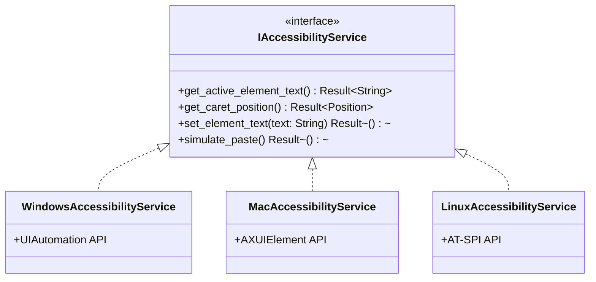
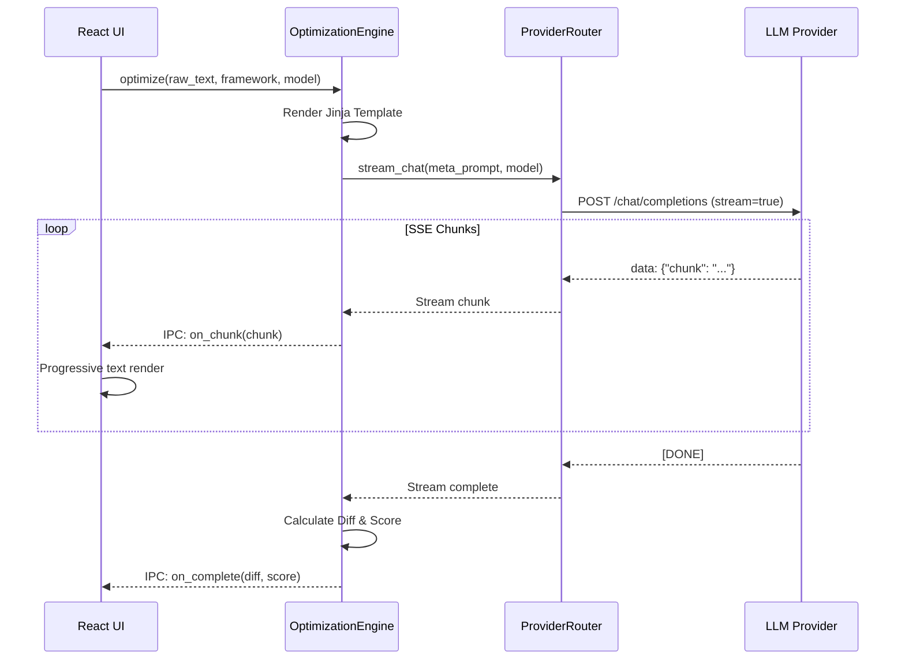

# Low-Level Design — PromptOpt Overlay

| Field | Value |
|-------|-------|
| **Document ID** | LLD-001 |
| **Version** | 1.0 |
| **Date** | 2026-06-17 |
| **Status** | Draft for Review |

---

## 1. Module Architecture (Rust Core)

The Rust backend is organized into crates/modules that expose traits for OS-specific functionality.

### 1.1 Accessibility Service Trait



### 1.2 In-Place Replacement Algorithm

```
FUNCTION replace_text(target_element, enhanced_text):
1.  IF app_profile.has_override(target_element.app_name):
2.      strategy = app_profile.override_strategy
3.  ELSE:
4.      strategy = determine_best_strategy(target_element)
    
5.  IF strategy == "Accessibility":
6.      TRY:
7.          target_element.focus()
8.          target_element.select_previous_range()
9.          target_element.set_value(enhanced_text)
10.         IF verify_text(target_element, enhanced_text): RETURN Success
11.     CATCH AccessibilityError:
12.         strategy = "Clipboard" // Fallback
    
13. IF strategy == "Clipboard":
14.     old_clipboard = clipboard.get()
15.     clipboard.set(enhanced_text)
16.     keyboard.simulate_paste() // Cmd+V / Ctrl+V
17.     sleep(50ms) // Allow app to process paste
18.     clipboard.set(old_clipboard) // Restore
19.     RETURN Success
```

---

## 2. Overlay Window Management

The overlay must appear instantly (<150ms) and **must not steal focus** from the target application.

### 2.1 Non-Activating Window Flags

| OS | Flag / API | Effect |
|----|-----------|--------|
| Windows | `WS_EX_NOACTIVATE` | Window does not receive focus on click. |
| macOS | `NSWindowStyleMaskNonactivatingPanel` | Panel floats above key window without activation. |
| Linux | `XSetInputFocus` bypass | Override-redirect window. |

### 2.2 Caret-Aware Positioning Algorithm

```
FUNCTION position_overlay(caret_pos, monitor_bounds):
1.  overlay_width = 400
2.  overlay_height = 300
3.  
4.  // Default: anchor below caret
5.  x = caret_pos.x
6.  y = caret_pos.y + 20
7.  
8.  // Edge-aware adjustments
9.  IF (x + overlay_width) > monitor_bounds.right:
10.     x = monitor_bounds.right - overlay_width - 10
11. IF (y + overlay_height) > monitor_bounds.bottom:
12.     y = caret_pos.y - overlay_height - 10 // Flip above caret
13. 
14. window.set_position(x, y)
```

---

## 3. Optimization Engine Design

### 3.1 Meta-Prompt Construction

The engine uses Jinja2/Mustache templates stored in SQLite.

**Template Example (CREATE Framework):**
```jinja
Context: {{ context_profile }}
Role: {{ role }}
Task: Optimize the following raw prompt using the CREATE framework.
Raw Prompt: {{ raw_prompt }}

Enhance for: Clarity, Specificity, Structure.
Return format: JSON { "enhanced_prompt": "...", "rationale": "...", "score": 0-100 }
```

### 3.2 Streaming Response Handler



---

## 4. App-Profile Registry

To handle apps that do not respond well to native accessibility `setValue`, an App-Profile registry is maintained.

| App Name | Strategy | Notes |
|----------|----------|-------|
| VS Code | Accessibility | Use `setValue` on Monaco editor node. |
| Chrome (Gmail) | Clipboard | Web SPAs often reject synthetic `setValue`. |
| Slack | Clipboard | Electron apps sometimes block accessibility write. |
| Terminal | Synthetic Keys | Terminals only accept keyboard input. |

---

## 5. Configuration & Key Vault

### 5.1 Encrypted Key Vault

API keys for cloud providers are NEVER stored in SQLite or plain text files.
They are stored in the OS-native keychain:

| OS | Service | Rust Crate |
|----|---------|------------|
| Windows | Credential Manager | `keyring` |
| macOS | Keychain | `keyring` |
| Linux | Secret Service (GNOME Keyring / KWallet) | `keyring` |

### 5.2 Settings Schema

```json
{
  "hotkey": "CmdOrCtrl+Shift+E",
  "overlay_theme": "dark",
  "default_framework": "APE",
  "default_model": "ollama:llama3",
  "privacy": {
    "telemetry": false,
    "cloud_allow": true,
    "pii_blocklist_regex": "(\\d{3}-\\d{2}-\\d{4})|credit_card"
  }
}
```

---

*End of Low-Level Design.*
