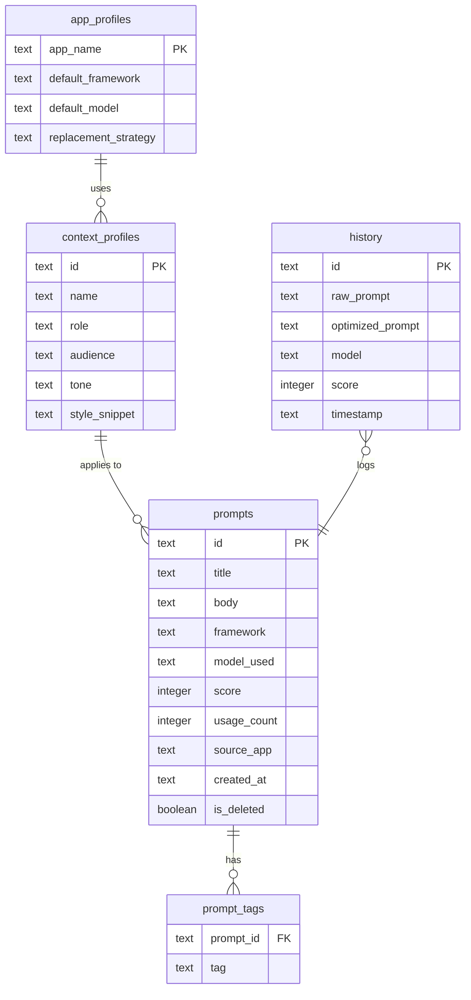

# Database Design — PromptOpt Overlay

| Field | Value |
|-------|-------|
| **Document ID** | DBD-001 |
| **Version** | 1.0 |
| **Date** | 2026-06-17 |
| **Status** | Draft for Review |

---

## 1. Overview

### 1.1 Database Engine
- **Engine:** SQLite 3 (via `rusqlite` crate)
- **Location:** `~/.promptopt/data.db`
- **Purpose:** Local storage for Prompt Library, Context Profiles, History, and App-Profiles.

### 1.2 Design Principles
1. All timestamps stored as ISO8601 strings (UTC).
2. Soft-delete for prompts (`is_deleted` flag) to preserve history integrity.
3. Full-text search (FTS5) enabled on prompt body and title.

---

## 2. ER Diagram



---

## 3. Table Definitions (DDL)

### 3.1 `prompts`

```sql
CREATE TABLE prompts (
    id          TEXT PRIMARY KEY,
    title       TEXT NOT NULL,
    body        TEXT NOT NULL,
    framework   TEXT,
    model_used  TEXT,
    score       INTEGER DEFAULT 0,
    usage_count INTEGER DEFAULT 0,
    source_app  TEXT,
    context_id  TEXT REFERENCES context_profiles(id),
    created_at  TEXT NOT NULL DEFAULT (datetime('now')),
    is_deleted  INTEGER NOT NULL DEFAULT 0
);

CREATE INDEX idx_prompts_framework ON prompts(framework);
CREATE INDEX idx_prompts_score ON prompts(score DESC);
```

### 3.2 `context_profiles`

```sql
CREATE TABLE context_profiles (
    id            TEXT PRIMARY KEY,
    name          TEXT NOT NULL,
    role          TEXT,
    audience      TEXT,
    tone          TEXT,
    style_snippet TEXT
);
```

### 3.3 `app_profiles`

```sql
CREATE TABLE app_profiles (
    app_name             TEXT PRIMARY KEY,
    default_framework    TEXT,
    default_model        TEXT,
    replacement_strategy TEXT CHECK(replacement_strategy IN ('Accessibility', 'Clipboard', 'SyntheticKeys'))
);
```

### 3.4 `history`

```sql
CREATE TABLE history (
    id                TEXT PRIMARY KEY,
    raw_prompt        TEXT NOT NULL,
    optimized_prompt  TEXT NOT NULL,
    model             TEXT NOT NULL,
    score             INTEGER,
    timestamp         TEXT NOT NULL DEFAULT (datetime('now'))
);

CREATE INDEX idx_history_timestamp ON history(timestamp DESC);
```

### 3.5 Full-Text Search (FTS5)

```sql
CREATE VIRTUAL TABLE prompts_fts USING fts5(
    title, body, tags,
    content='prompts', content_rowid='rowid'
);

-- Triggers to keep FTS in sync
CREATE TRIGGER prompts_ai AFTER INSERT ON prompts BEGIN
    INSERT INTO prompts_fts(rowid, title, body) VALUES (new.rowid, new.title, new.body);
END;
```

---

*End of Database Design.*
