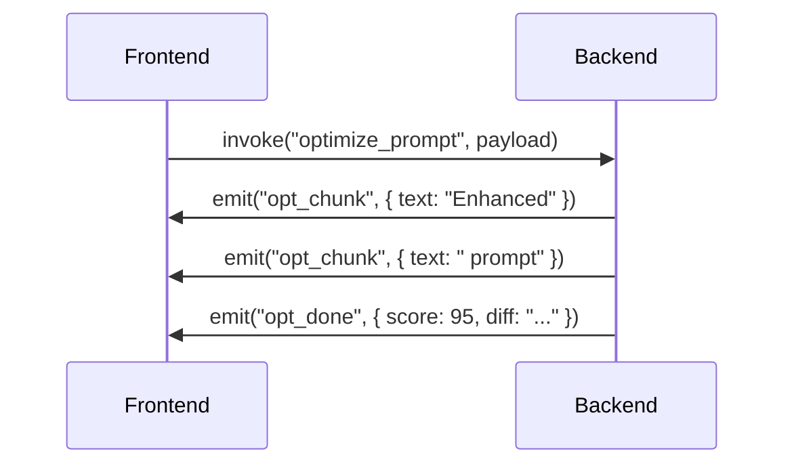

# API Design — PromptOpt Overlay

| Field | Value |
|-------|-------|
| **Document ID** | APID-001 |
| **Version** | 1.0 |
| **Date** | 2026-06-17 |
| **Status** | Draft for Review |

---

## 1. Overview

### 1.1 API Style
The application uses two distinct API layers:
1. **Internal IPC (Tauri Commands):** Communication between the React frontend and Rust backend.
2. **External REST (LLM Adapters):** Communication with local/cloud LLM providers, normalized behind an adapter trait.

---

## 2. Tauri IPC Commands (Frontend ↔ Backend)

### 2.1 Command Catalogue

| Command | Payload | Returns | Description |
|---------|---------|---------|-------------|
| `capture_text` | `{}` | `{ text: String, caret_pos: {x, y} }` | Triggers accessibility capture of active field. |
| `optimize_prompt` | `{ raw: String, framework: String, model: String, context_id: Option<String> }` | `Stream<String>` | Starts optimization, streams chunks via events. |
| `accept_replacement` | `{ text: String }` | `{ success: bool, fallback: bool }` | Triggers in-place replacement. |
| `get_models` | `{ provider: String }` | `[{ id: String, name: String }]` | Fetches available models from provider. |
| `save_prompt` | `Prompt` | `{ id: String }` | Saves to library. |
| `get_settings` | `{}` | `Settings` | Loads config. |

### 2.2 Streaming Events

Since Tauri commands are typically request-response, streaming is handled via Tauri Events:



---

## 3. External LLM Adapter API

### 3.1 Unified Adapter Trait (Rust)

```rust
#[async_trait]
pub trait LLMAdapter {
    async fn chat(&self, messages: Vec<Message>, params: ChatParams) -> Result<ChatResponse>;
    async fn stream_chat(&self, messages: Vec<Message>, params: ChatParams) -> Result<ChatStream>;
    async fn list_models(&self) -> Result<Vec<ModelInfo>>;
    fn health_check(&self) -> bool;
}
```

### 3.2 OpenAI / OpenRouter / LM Studio Payload

```json
POST /v1/chat/completions
{
  "model": "gpt-4o",
  "messages": [
    {"role": "system", "content": "Optimize this prompt using CREATE framework..."},
    {"role": "user", "content": "write marketing copy"}
  ],
  "stream": true,
  "temperature": 0.7
}
```

### 3.3 Ollama Payload

```json
POST /api/chat
{
  "model": "llama3",
  "messages": [
    {"role": "user", "content": "write marketing copy"}
  ],
  "stream": true
}
```

### 3.4 Anthropic Payload

```json
POST /v1/messages
Headers: x-api-key: ..., anthropic-version: 2023-06-01
{
  "model": "claude-3-5-sonnet-20240620",
  "max_tokens": 1024,
  "messages": [
    {"role": "user", "content": "write marketing copy"}
  ],
  "stream": true
}
```

---

## 4. Error Handling

### 4.1 IPC Error Envelope

```json
{
  "error": {
    "code": "PROVIDER_UNREACHABLE",
    "message": "Ollama server not found on localhost:11434",
    "details": "Connection refused"
  }
}
```

| Code | Meaning |
|------|---------|
| `PROVIDER_UNREACHABLE` | Local LLM server is down or cloud endpoint blocked. |
| `REPLACEMENT_FAILED` | Cannot write to target field. |
| `PERMISSION_DENIED` | Accessibility permissions not granted. |
| `PII_BLOCKED` | Cloud routing blocked due to PII regex match. |

---

*End of API Design.*
