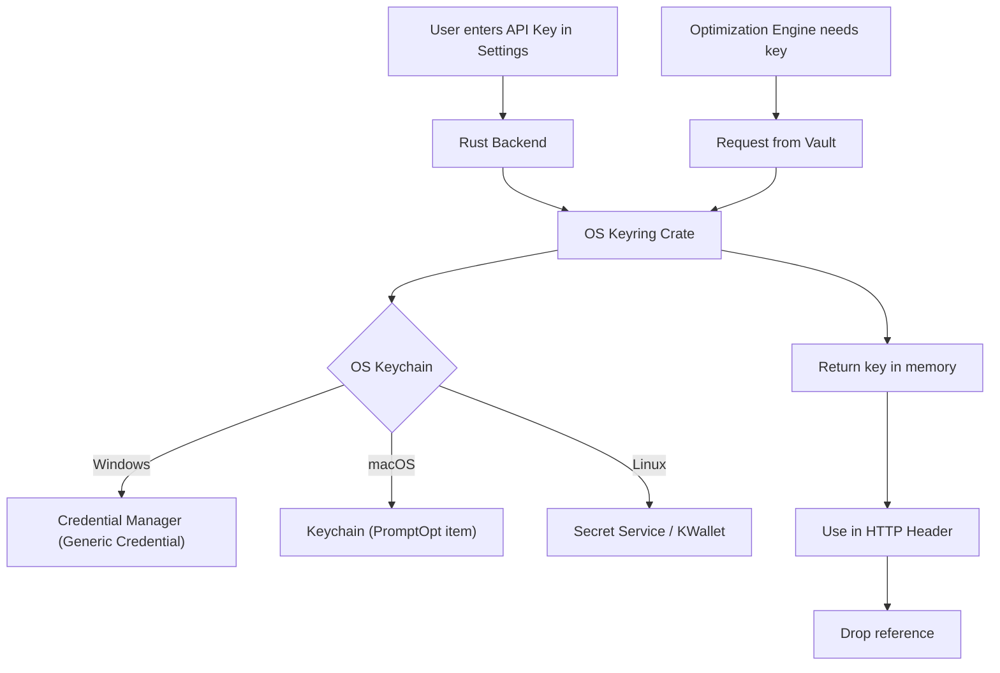

# Security Design — PromptOpt Overlay

| Field | Value |
|-------|-------|
| **Document ID** | SEC-001 |
| **Version** | 1.0 |
| **Date** | 2026-06-17 |
| **Status** | Draft for Review |

---

## 1. Security Principles

1. **Local-First:** All data stays on the user's machine unless explicitly routed to cloud.
2. **Zero Telemetry:** No analytics, crash reports, or usage tracking by default.
3. **Secrets Isolation:** API keys are never stored in config files or databases.
4. **Privacy Guard:** Active prevention of accidental PII leakage to cloud providers.

---

## 2. Threat Model

| Threat | Vector | Mitigation |
|--------|--------|------------|
| **API Key Leakage** | Malware reading local config files | Keys stored in OS Keychain (Credential Manager / Keychain / Secret Service). Never written to disk. |
| **PII Exposure** | User accidentally sending PII to cloud LLM | PII Regex Blocklist engine scans raw prompt before cloud routing. |
| **Malicious Prompt Injection** | LLM output contains executable code that auto-replaces | User must explicitly click "Accept". No auto-accept mode. |
| **Overlay Hijacking** | Another app tries to send fake hotkeys | Hotkeys registered at OS kernel level (RegisterHotKey / CGEventTap). |

---

## 3. API Key Vault



### 3.1 Key Management Rules
- Keys are never logged in error reports or console output.
- Keys are only fetched from the vault at the time of the HTTP request.
- The "Export Settings" feature exports everything EXCEPT keys; user must re-enter on import.

---

## 4. Privacy Guard (PII Blocklist)

Before routing a prompt to a Cloud LLM, the engine runs a regex check.

### 4.1 Default Regex Patterns
- **Credit Cards:** `\b(?:\d[ -]*?){13,16}\b`
- **SSN:** `\b\d{3}-\d{2}-\d{4}\b`
- **Emails:** `\b[A-Za-z0-9._%+-]+@[A-Za-z0-9.-]+\.[A-Z|a-z]{2,}\b` (Optional)

### 4.2 Flow

```mermaid
flowchart TD
    A[Optimize Request] --> B{Routing Target?}
    B -->|Local| C[Allow - Send to Local LLM]
    B -->|Cloud| D{Check PII Blocklist}
    D -->|Match Found| E[Block Cloud Routing]
    E --> F[Show Warning: "PII Detected, forcing local"]
    E --> G[Switch to Local Model]
    D -->|No Match| H[Allow - Send to Cloud LLM]
```

---

## 5. Application Permissions

### 5.1 Required OS Permissions

| OS | Permission | Reason |
|----|-----------|--------|
| macOS | Accessibility | To read/insert text in other apps. |
| macOS | Input Monitoring | To capture global hotkeys. |
| Windows | UIAutomation | To read/insert text (does not require admin, but requires app to be signed). |
| Linux | AT-SPI Bus | To interact with accessibility tree. |

### 5.2 Network Egress
- The application makes NO outbound network calls on startup.
- Network calls occur ONLY when:
  1. User clicks "Optimize" with a Cloud provider selected.
  2. App checks for updates (if auto-update is enabled).
- No telemetry endpoints exist in the codebase.

---

*End of Security Design.*
