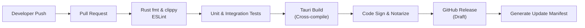
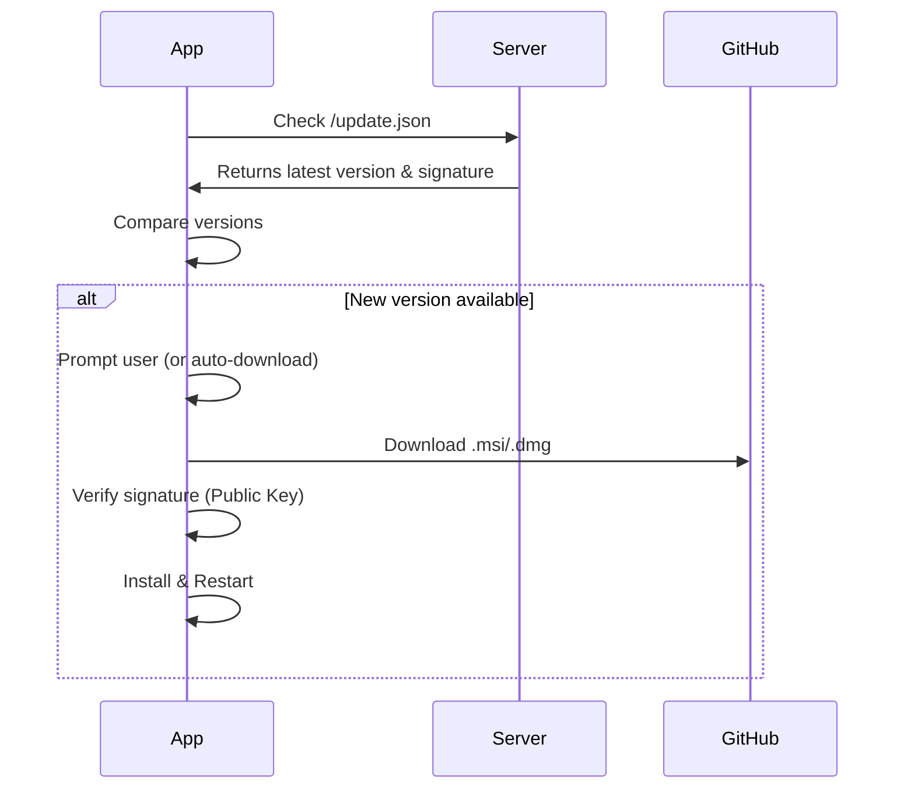

# Deployment Design — PromptOpt Overlay

| Field | Value |
|-------|-------|
| **Document ID** | DEP-001 |
| **Version** | 1.0 |
| **Date** | 2026-06-17 |
| **Status** | Draft for Review |

---

## 1. Overview

### 1.1 Deployment Philosophy
- **Cross-Platform:** Single Tauri codebase compiled to native binaries for Windows, macOS, and Linux.
- **Code Signing:** All binaries signed to prevent OS permission prompts (macOS notarization, Windows Authenticode).
- **Auto-Update:** Built-in updater for seamless minor/patch updates.

---

## 2. Build & CI/CD Pipeline

### 2.1 Build Environments
Since Tauri compiles native code, cross-compilation is complex. CI/CD uses matrix builds:

| OS | Runner | Output Format |
|----|--------|---------------|
| Windows | `windows-latest` | `.msi` (64-bit), `.exe` (NSIS) |
| macOS | `macos-latest` | `.dmg` (Universal Binary: Intel + Apple Silicon) |
| Linux | `ubuntu-latest` | `.deb`, `.rpm`, `.AppImage` |

---

## 3. Code Signing & Permissions

### 3.1 macOS Notarization
To request Accessibility permissions without scary warnings, the app must be notarized.
1. Code sign with Developer ID Application certificate.
2. Submit `.app` to Apple's notary service.
3. Staple the notarization ticket.
4. **UIAccess Manifest:** Tauri config includes `LSUIElement` to allow overlay floating.

### 3.2 Windows Authenticode
1. Sign `.exe` and `.msi` with EV Code Signing Certificate.
2. Include `app.manifest` requesting `uiAccess="true"` to allow overlay to draw over elevated windows (optional).

---

## 4. Auto-Update Strategy

Tauri's built-in updater is used.

### 4.1 Update Flow

### 4.2 Update Channels
- **Stable:** Default channel, thoroughly tested.
- **Beta:** Optional channel for early adopters.

---

## 5. Installer Configuration

### 5.1 Bundle Identifiers
- Windows: `com.promptopt.app`
- macOS: `com.promptopt.overlay`
- Linux: `com.promptopt.Overlay`

### 5.2 First-Run Experience
1. Installer copies binary to Applications/Program Files.
2. On first launch, app creates `~/.promptopt/` directory.
3. Initializes SQLite DB.
4. Prompts for Accessibility/Input Monitoring permissions.
5. Prompts to configure default LLM provider (Ollama auto-detect).

---

*End of Deployment Design.*
