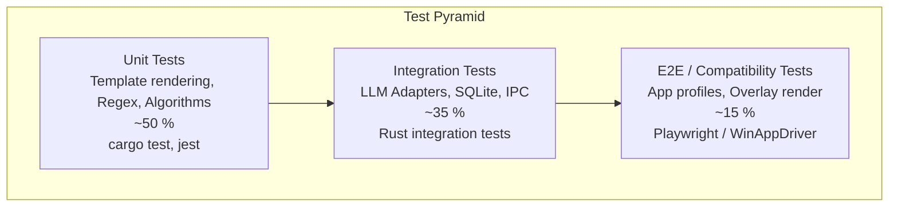

# Test Strategy — PromptOpt Overlay

| Field | Value |
|-------|-------|
| **Document ID** | TST-001 |
| **Version** | 1.0 |
| **Date** | 2026-06-17 |
| **Status** | Draft for Review |

---

## 1. Overview

Testing a cross-platform overlay app requires heavy emphasis on OS-level integration testing and UI compatibility.

### 1.1 Testing Challenges
- **OS Accessibility APIs:** Must test reading/writing across 50+ apps.
- **Non-Activating Windows:** Overlay must not steal focus.
- **Hotkey Conflicts:** Must detect conflicts with popular apps (Discord, IDEs).

---

## 2. Test Pyramid

---

## 3. App Compatibility Matrix (E2E)

A curated suite of 50+ applications is tested for in-place replacement reliability.

| Category | Apps Tested | Expected Strategy |
|----------|-------------|-------------------|
| IDEs | VS Code, IntelliJ, Eclipse | Accessibility API |
| Browsers | Chrome, Firefox, Safari (Gmail, ChatGPT) | Clipboard Fallback |
| Chat | Slack, Discord, Teams | Clipboard / Accessibility |
| Native | Notepad, TextEdit | Accessibility API |
| Terminal | Windows Terminal, iTerm2 | Synthetic Keys |

### 3.1 Automated Compatibility Testing
- **Windows:** Use `WinAppDriver` to launch target apps, focus input, trigger hotkey, and verify replacement.
- **macOS:** Use `AppleScript` or `macOS Automator` to simulate UI interactions.

---

## 4. Test Cases (Functional)

| ID | Test Case | Steps | Expected Result |
|----|-----------|-------|-----------------|
| TC-01 | Capture text from VS Code | 1. Focus VS Code editor 2. Press Cmd/Ctrl+Shift+E | Overlay appears with selected code |
| TC-02 | In-place replace in Notepad | 1. Optimize prompt 2. Click Accept | Text in Notepad updates without focus loss |
| TC-03 | Clipboard Fallback | 1. Target Chrome (Gmail) 2. Click Accept | Clipboard restored, text pasted |
| TC-04 | Hotkey Conflict | 1. Bind to Cmd+Shift+S (Chrome save) | UI warns about conflict |
| TC-05 | Local LLM Stream | 1. Select Ollama 2. Optimize | Overlay shows streaming text |
| TC-06 | PII Block | 1. Enter SSN in prompt 2. Select Cloud LLM | Routing blocked, forced to Local |

---

## 5. Performance Testing

| Metric | Target | Tool |
|--------|--------|------|
| Overlay Render Latency | < 150 ms | Tauri Benchmarks |
| Idle RAM | < 120 MB | OS Task Manager |
| Replacement Execution | < 50 ms | Rust `Instant` timer |
| Cold Start | < 1.5 s | Custom script |

---

## 6. Security Testing

| Test | Method |
|------|--------|
| Key Leakage | `grep -r "sk-" ~/.promptopt` (should be empty) |
| Telemetry Check | Wireshark monitoring on idle app (no traffic) |
| PII Regex | Fuzzing with generated PII strings |

---

*End of Test Strategy.*
