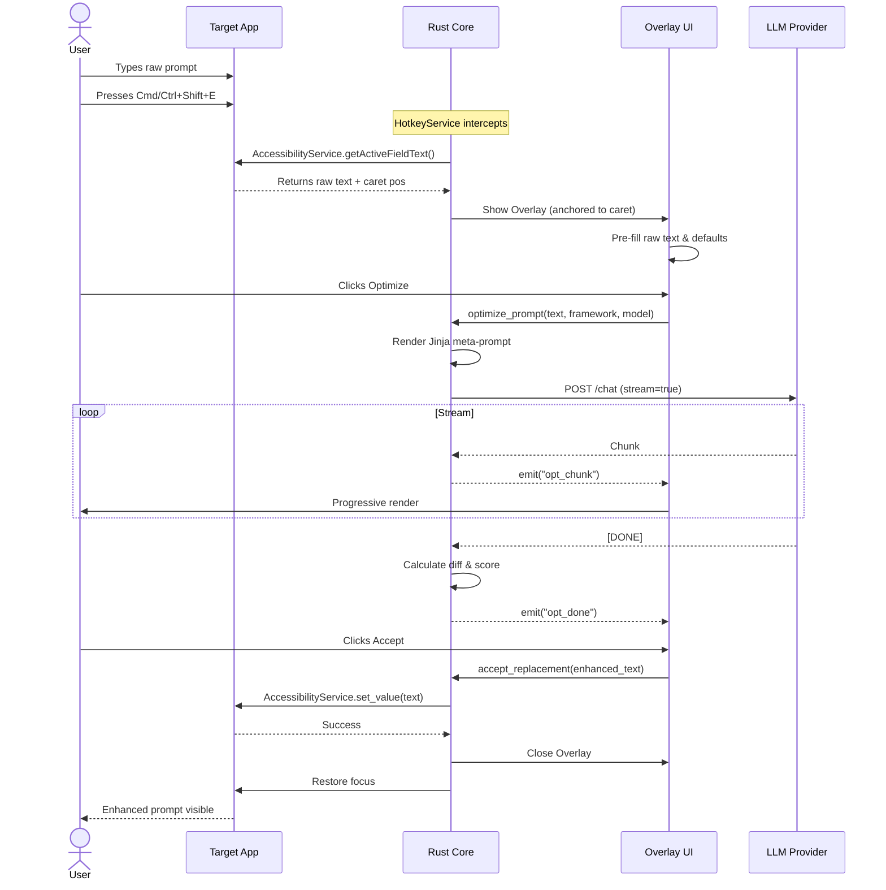
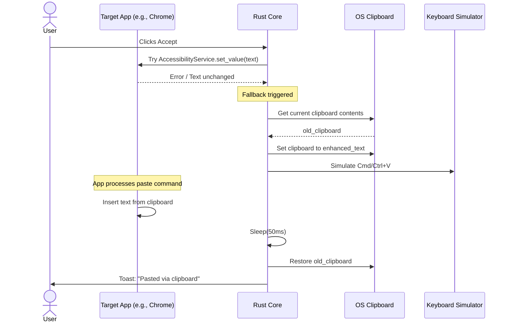
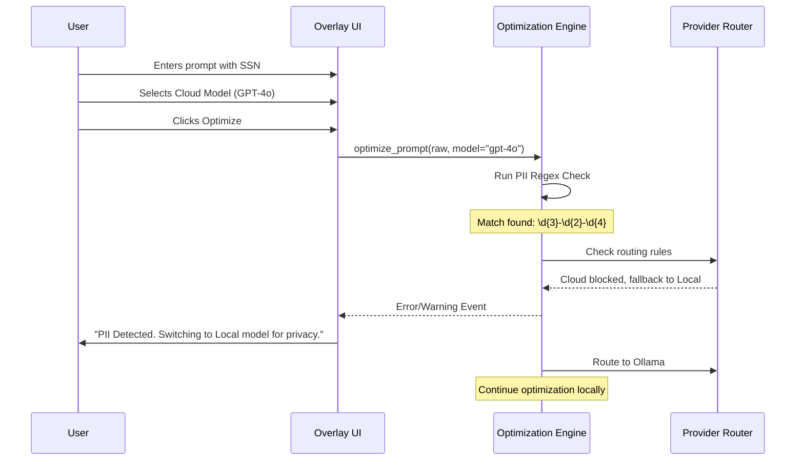
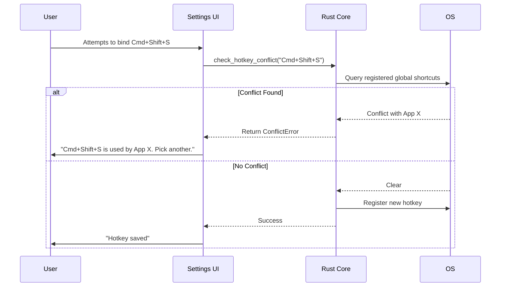

# Sequence Diagrams — PromptOpt Overlay

| Field | Value |
|-------|-------|
| **Document ID** | SEQ-001 |
| **Version** | 1.0 |
| **Date** | 2026-06-17 |
| **Status** | Draft for Review |

---

## 1. Introduction

This document details the core interaction flows for the PromptOpt Overlay application.

## 2. Main Success Scenario (MSS)

---

## 3. Alternate Flow: Clipboard Fallback

Triggered when the target application does not support native Accessibility `setValue`.

---

## 4. Alternate Flow: PII Privacy Guard

Triggered when a user attempts to optimize a prompt containing PII with a Cloud provider.

---

## 5. Alternate Flow: Hotkey Conflict Detection

---

*End of Sequence Diagrams.*
