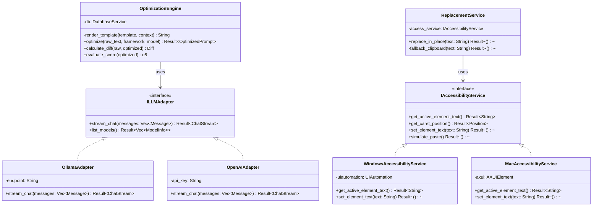
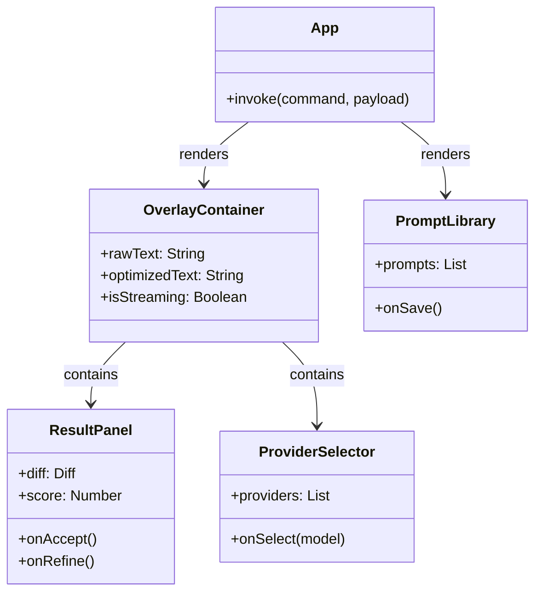
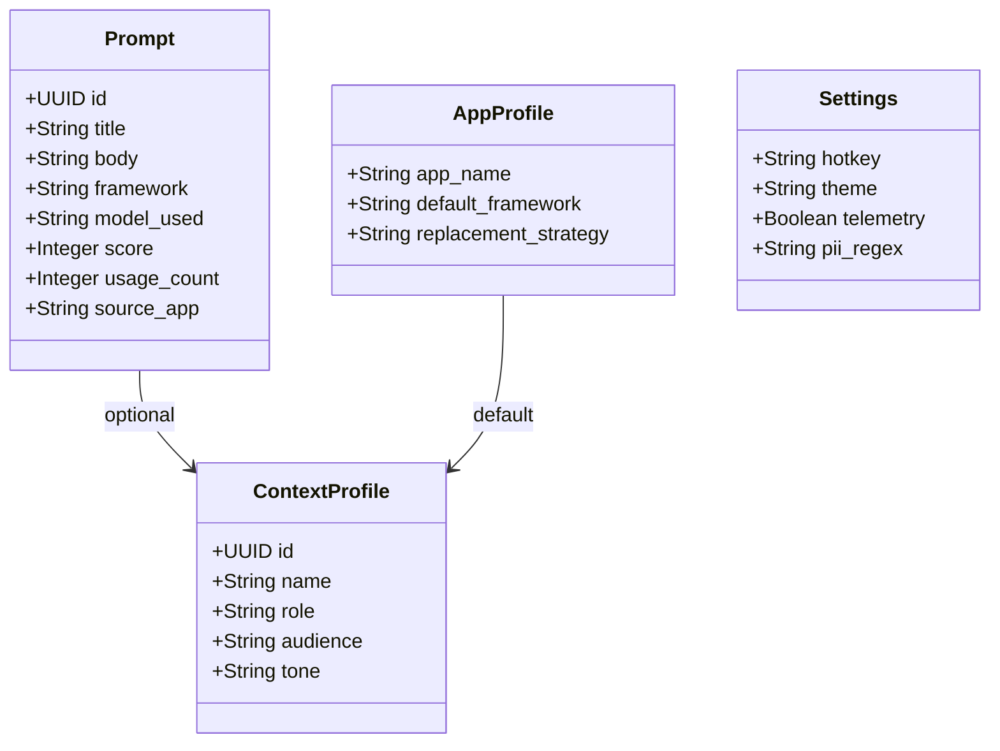

# Class Diagram — PromptOpt Overlay

| Field | Value |
|-------|-------|
| **Document ID** | CLS-001 |
| **Version** | 1.0 |
| **Date** | 2026-06-17 |
| **Status** | Draft for Review |

---

## 1. Introduction

This document outlines the core class structures for both the Rust backend (Traits and Structs) and the React frontend (Components).

---

## 2. Rust Backend Core

---

## 3. React Frontend Components

---

## 4. Data Models

---

*End of Class Diagram.*
