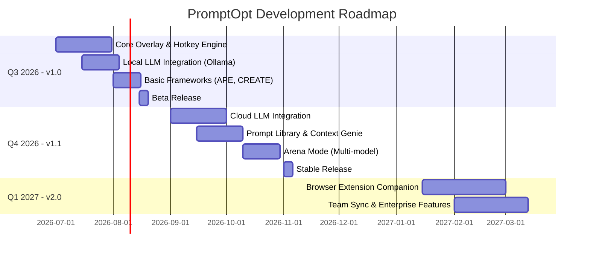
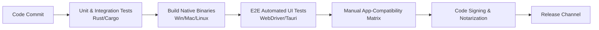

# Product Requirements Document (PRD): PromptOpt Overlay

**Document Version:** 1.0
**Last Updated:** 2026-06-17

## 1. Product Vision
To create the ultimate, privacy-first prompt optimization companion that lives directly on the user's desktop, bridging the gap between human intent and AI capability without forcing users to switch contexts or copy-paste text.

## 2. Target Audience
1. **Prompt Engineers & AI Power Users:** Need fine-grained control, framework selection, and multi-model testing.
2. **Developers & Data Scientists:** Prefer running local models (Ollama/LM Studio) for privacy and want IDE integration.
3. **Marketers & Content Creators:** Require high-quality outputs from frontier cloud models with persistent brand context.
4. **Enterprise Teams:** Need a secure, local-first tool that doesn't leak proprietary data to third-party logging services.

## 3. Competitive Analysis
- **PromptPerfect (Jina AI):** Excellent web-based optimizer, but requires leaving the workspace. 
- **Prompt Genie:** Great browser extension, but limited to web UIs and lacks local model support.
- **SiteGPT Optimizer:** Good framework templates, but isolated as a standalone web tool.
**PromptOpt Advantage:** Combines the frameworks of SiteGPT, the multi-model scoring of PromptPerfect, and the in-app nature of Prompt Genie, while adding native desktop overlay capabilities and local LLM support.

## 4. Business Model
- **Core App (Open Source / Free):** Local LLM support, basic frameworks, standard overlay, prompt library.
- **Pro Tier (Subscription / One-time):** Advanced framework packs, Arena mode, team sync, custom CSS themes.
- **Enterprise Tier:** Self-hosted sync server, SSO, audit logs.

## 5. Roadmap



---

# 2. API & Integration Guide

**Document Version:** 1.0
**Last Updated:** 2026-06-17

## 1. Overview
PromptOpt is designed with a pluggable architecture. Developers can extend the application by writing custom LLM Provider Adapters, custom Framework Templates, or interacting with the app via a local CLI.

## 2. Writing a Custom Provider Adapter
Providers are implemented in Rust as plugins implementing the `LlmProvider` trait.

### Trait Definition
```rust
pub trait LlmProvider: Send + Sync {
    fn id(&self) -> &str;
    fn name(&self) -> &str;
    fn list_models(&self) -> Result<Vec<ModelInfo>, ProviderError>;
    fn chat_completion(&self, messages: Vec<Message>, params: ChatParams) -> Result<String, ProviderError>;
    fn stream_chat_completion(&self, messages: Vec<Message>, params: ChatParams) -> Result<ChatStream, ProviderError>;
}
```
*Note: Adapters are compiled into the core binary via feature flags or dynamically loaded if compiled as WASM modules (planned for v2).*

## 3. Custom Framework Templates
Frameworks are defined as JSON/YAML data structures containing a Jinja2-like template string.

### Example: Custom "APE" Framework JSON
```json
{
  "id": "custom_ape",
  "name": "Custom APE Framework",
  "template": "Action: {{ action }}\nPurpose: {{ purpose }}\nExpectation: {{ expectation }}\n\nRaw Prompt: {{ raw_prompt }}",
  "variables": ["action", "purpose", "expectation"]
}
```
Users can import these JSON files directly via the Settings > Frameworks tab.

## 4. Command Line Interface (CLI)
PromptOpt exposes a local IPC socket for CLI automation.
- **Command:** `promptopt optimize`
- **Usage:** `promptopt optimize --text "Write a blog post" --model "ollama:llama3" --framework "CREATE"`
- **Output:** Prints the optimized prompt string to stdout.

---

# 3. Test & QA Plan

**Document Version:** 1.0
**Last Updated:** 2026-06-17

## 1. Testing Strategy
The QA strategy encompasses automated unit/integration tests, E2E UI tests, and a rigorous manual app-compatibility matrix due to the reliance on OS Accessibility APIs.

## 2. Testing Pipeline



## 3. App Compatibility Matrix
In-place replacement must be manually verified across a suite of common applications per OS.

| App Category | Windows App | macOS App | Linux App | Strategy |
|---|---|---|---|---|
| Browser Textarea | Chrome / Edge | Safari / Chrome | Firefox | Accessibility / DOM Injection |
| IDE | VS Code / IntelliJ | VS Code / Xcode | VS Code | Accessibility / Synthetic Keys |
| Office Suite | MS Word | Pages | LibreOffice | Accessibility / Clipboard Fallback |
| Chat / Comms | Slack / Teams | Slack / Messages | Slack | Accessibility |

## 4. Performance Benchmarks
- Overlay cold-render time must be < 150ms (Tested via high-speed screen capture).
- Idle memory footprint must remain < 120MB RAM.
- API Key vault encryption/decryption must add < 5ms latency to a cloud request.

---

# 4. Deployment & Release Plan

**Document Version:** 1.0
**Last Updated:** 2026-06-17

## 1. CI/CD Pipeline
Builds are automated using GitHub Actions. On a tagged commit, the pipeline builds, signs, and packages the application for all three major OSs.

## 2. Code Signing & Notarization
- **Windows:** Binaries are signed using `signtool` with an Extended Validation (EV) certificate to prevent SmartScreen warnings.
- **macOS:** Binaries are signed and notarized via `xcrun altool` / `notarytool` to pass Gatekeeper.
- **Linux:** Packaged as AppImage (universal), .deb (Debian/Ubuntu), and .rpm (Fedora).

## 3. Auto-Update Mechanism
Utilizes the Tauri Updater plugin.
1. App periodically checks a static JSON endpoint (e.g., `https://updates.promptopt.io/latest.json`).
2. If a newer version is found, the app downloads the signed payload.
3. Signature is verified against a hardcoded public key in the app.
4. User is prompted to install and restart.

## 4. Distribution Channels
- **Direct Download:** Primary channel from the project website.
- **Package Managers:** Homebrew (macOS), Winget (Windows), AUR (Linux).
- **Browser Extension (v2):** Chrome Web Store / Firefox Add-ons.

---

# 5. User Manual / Getting Started Guide

**Document Version:** 1.0
**Last Updated:** 2026-06-17

## 1. Installation
1. Download the appropriate installer for your operating system from the official website.
2. Run the installer (Windows: `.exe` or `.msi`, macOS: `.dmg`, Linux: `.AppImage` or `.deb`).
3. Launch PromptOpt. It will initialize in the system tray.

## 2. Granting Permissions
On first launch, PromptOpt will request Accessibility permissions to read and replace text in your active apps.
- **macOS:** System Settings > Privacy & Security > Accessibility > Enable PromptOpt.
- **Windows:** The app will request UI Automation access (UAC prompt may appear for elevated apps).
- **Linux:** No special permissions required for AT-SPI, but keyring access may be prompted for API key storage.

## 3. Configuring your first LLM
1. Click the system tray icon and select **Settings**.
2. Navigate to the **Models** tab.
3. **Local Setup:** Ensure Ollama or LM Studio is running locally. Click the "Detect Local Servers" button.
4. **Cloud Setup:** Select a provider (e.g., OpenAI) and paste your API key. The key is securely stored in your OS keychain.

## 4. Using the Overlay
1. Open any application with a text input (e.g., your browser, an email client, or an IDE).
2. Type a rough prompt or select existing text.
3. Press `Ctrl/Cmd + Shift + E`.
4. The PromptOpt overlay will appear near your cursor.
5. Select a framework (e.g., `CREATE`) and click **Optimize**.
6. Review the enhanced prompt and quality score.
7. Press `Enter` or click **Accept**. The optimized text will instantly replace your original text.

## 5. Keyboard Shortcuts
| Shortcut | Action |
|---|---|
| `Ctrl/Cmd + Shift + E` | Open Overlay / Optimize Selected Text |
| `Enter` | Accept and Replace in-place |
| `Shift + Enter` | Insert newline in overlay |
| `Esc` | Close overlay and discard |
| `Ctrl/Cmd + R` | Refine current prompt |
| `Ctrl/Cmd + M` | Switch target model |
