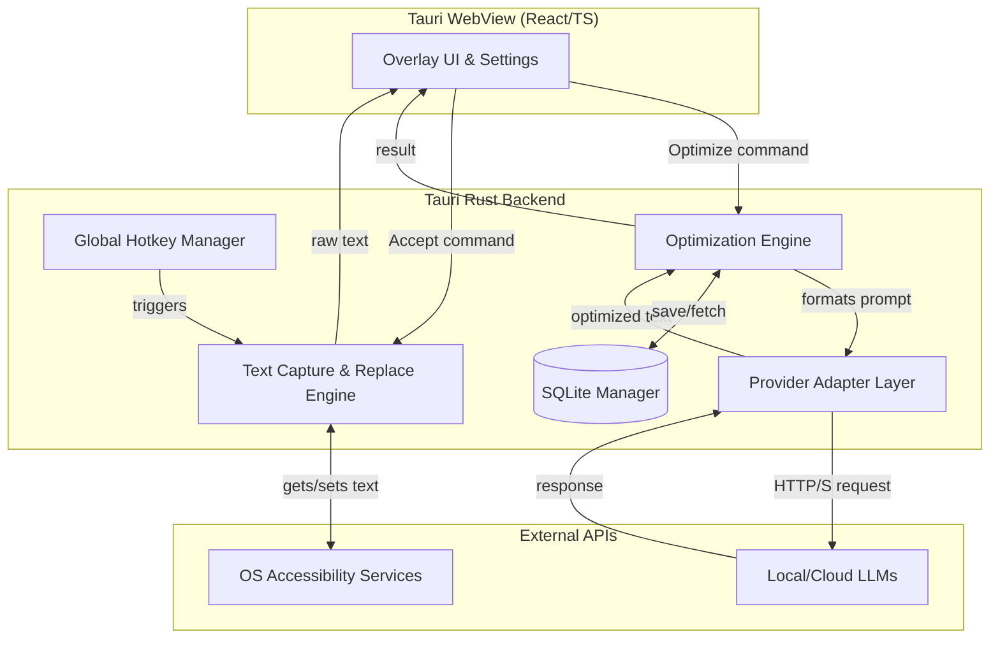
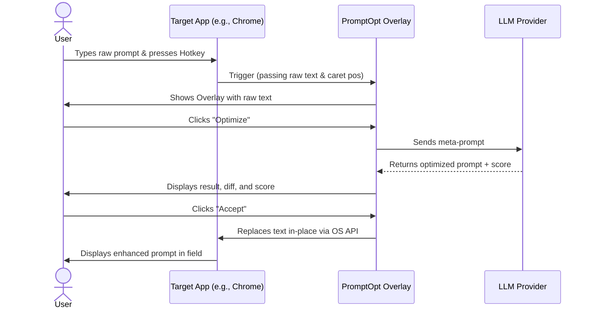
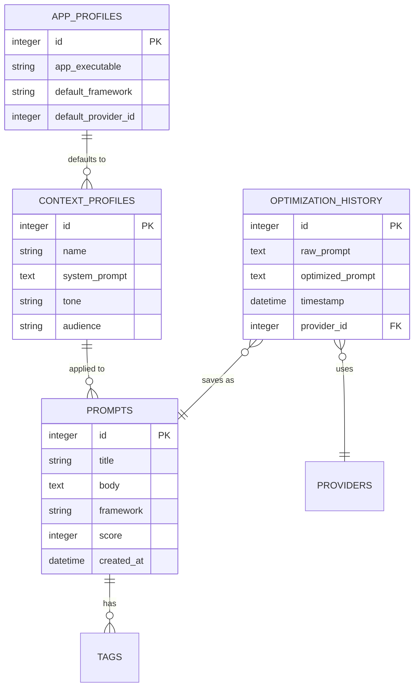

# Technical Specification: PromptOpt Overlay

**Document Version:** 1.0
**Last Updated:** 2026-06-17

## 1. Overview
This document outlines the technical architecture, technology stack, and component-level design for the PromptOpt Overlay application. The application is a cross-platform, local-first desktop utility that intercepts user text via a global hotkey, optimizes it using local or cloud LLMs, and replaces it in-place.

## 2. Technology Stack
- **Core Framework:** Tauri v2 (Rust backend + WebView frontend)
- **Frontend UI:** React (TypeScript) + Tailwind CSS + Framer Motion (for overlay animations)
- **Database:** SQLite (via `rusqlite` in Rust)
- **Local LLM Communication:** REST API calls to `localhost` (Ollama, LM Studio)
- **Cloud LLM Communication:** HTTPS REST APIs (OpenAI, Anthropic, OpenRouter)
- **OS Accessibility APIs:**
  - **Windows:** UI Automation (UIA) / Win32 API
  - **macOS:** Accessibility API (AXUIElement)
  - **Linux:** AT-SPI2

## 3. Architecture Diagram



## 4. Component Design

### 4.1 Global Hotkey Manager (Rust)
Utilizes the `tauri-plugin-global-shortcut` package. Listens for `Ctrl/Cmd + Shift + E`. On trigger, it invokes the Text Capture engine. Includes a conflict detector that queries the OS registry for existing shortcuts on app launch.

### 4.2 Text Capture & Replace Engine (Rust)
- **Capture:** Queries the OS Accessibility tree to find the currently focused UI element. Extracts the selected text or the entire value of the input field.
- **Replace:** Accepts the optimized text string. Programmatically sets focus back to the target field, selects the previous text range, and uses the Accessibility API's `SetValue` or `SetText` to replace it. Fallback to clipboard injection + synthetic `Cmd/Ctrl+V` if accessibility write fails.

### 4.3 Optimization Engine (Rust/TS)
Constructs the meta-prompt by combining:
1. The raw user prompt.
2. The selected framework template (e.g., CREATE, RACE).
3. The active Context Profile (role, tone, audience).
Routes the compiled messages array to the Provider Adapter Layer.

### 4.4 Provider Adapter Layer (Rust)
Implements a `LlmProvider` trait with methods like `list_models()`, `chat_completion()`, and `stream_chat_completion()`.
- **Ollama Adapter:** Calls `http://localhost:11434/api/chat`.
- **OpenAI Adapter:** Calls `https://api.openai.com/v1/chat/completions`.
- Handles exponential backoff and timeout management.

---

# 2. UI/UX Design Document

**Document Version:** 1.0
**Last Updated:** 2026-06-17

## 1. Design Principles
- **Frictionless:** Zero copy-paste required. The overlay acts as a transient assistant.
- **Unobtrusive:** Must not steal focus from the target application. Non-activating windows are used.
- **Informative:** Provide immediate feedback (loading states, quality scores, diffs).

## 2. Core User Flow



## 3. Overlay Window Layout
The overlay is a borderless, always-on-top window (approx 400x300px, resizable).
- **Header:** Target Model Selector (Dropdown), Framework Selector (Dropdown), Context Profile Chip.
- **Body (Split View):**
  - *Left Pane:* Original raw prompt (editable).
  - *Right Pane:* Optimized prompt (editable, with syntax highlighting for markdown/variables).
- **Footer:** 
  - Quality Score Badge (0-100).
  - Action Buttons: `Refine` (loops with user notes), `Try Another Model` (Arena), `Save to Library`, `Accept` (Primary action, mapped to `Enter`).

## 4. Application States
1. **Idle/Empty:** Triggered with no text selected. Shows a text input area for manual entry.
2. **Loading/Streaming:** Shows a subtle shimmer effect on the right pane. If streaming is enabled, text populates character by character.
3. **Error:** Inline error message with "Retry" or "Switch Model" options. Never uses blocking OS alert dialogs.
4. **Arena Mode:** Expands overlay to full-width. Shows 2-4 columns, each rendering the output of a different LLM simultaneously for comparison.

## 5. Settings & Customization Window
A standard desktop window accessible from the system tray.
- **Tabs:** General, Models, Frameworks, Appearance, Privacy.
- **Appearance:** Theme picker (System/Light/Dark), Custom CSS injection area, Overlay Opacity slider.

---

# 3. Security & Privacy Document

**Document Version:** 1.0
**Last Updated:** 2026-06-17

## 1. Security Philosophy
The application operates on a "Local-First, Privacy by Default" principle. No telemetry is collected. Cloud requests are strictly opt-in and heavily guarded.

## 2. API Key Management
- **Storage:** Cloud API keys (OpenAI, Anthropic) are never stored in plain text or config files. They are encrypted and stored in the OS-native credential manager:
  - macOS: Keychain
  - Windows: Credential Manager (DPAPI)
  - Linux: libsecret / GNOME Keyring
- **Access:** Keys are fetched in memory only at the moment of making an API call and are cleared from memory immediately after.

## 3. Data Privacy & PII Protection
- **PII Blocklist:** Users can define regex patterns (e.g., SSN, credit cards, internal IPs) in Settings.
- **Routing Guard:** Before routing a prompt to a *Cloud* provider, the engine scans the raw text against the PII blocklist. If a match is found, the cloud request is aborted, and the app forces routing to a *Local* model, displaying a warning toast: "Sensitive data detected; routed to local model."
- **History Retention:** Optimization history is stored locally in SQLite. Users can set an auto-purge timer (e.g., 7 days, 30 days, or "Never save history").

## 4. Network Security
- **Local Communication:** Communicates with local LLM servers (Ollama, LM Studio) via `http://localhost`. No external ports are opened by the app.
- **Cloud Communication:** Uses standard HTTPS/TLS 1.2+ for all cloud API interactions. Certificate pinning is not enforced by default to allow corporate proxy scanning, but strict TLS verification is enabled.

## 5. Accessibility Permissions
The app requires OS Accessibility/Input Monitoring permissions to read and replace text. The app explicitly documents why these are needed and prompts the user to grant them on first launch. The app does not log keystrokes; it only reads the active field state when the hotkey is explicitly pressed.

---

# 4. Data Model Specification

**Document Version:** 1.0
**Last Updated:** 2026-06-17

## 1. Overview
All local data is stored in a single `promptopt.db` SQLite database file located in the OS-specific application data directory.

## 2. Entity Relationship Diagram (ERD)



## 3. Schema Definitions

### Table: `prompts`
Stores user-saved, optimized prompts for reuse.
```sql
CREATE TABLE prompts (
    id INTEGER PRIMARY KEY AUTOINCREMENT,
    title TEXT NOT NULL,
    body TEXT NOT NULL,
    framework TEXT,
    score INTEGER DEFAULT 0,
    usage_count INTEGER DEFAULT 0,
    created_at DATETIME DEFAULT CURRENT_TIMESTAMP
);
```

### Table: `context_profiles`
Stores persistent context ("Context Genie") injected into every optimization.
```sql
CREATE TABLE context_profiles (
    id INTEGER PRIMARY KEY AUTOINCREMENT,
    name TEXT NOT NULL,
    system_prompt TEXT,
    tone TEXT,
    audience TEXT,
    is_default BOOLEAN DEFAULT 0
);
```

### Table: `app_profiles`
Per-application settings to customize behavior automatically.
```sql
CREATE TABLE app_profiles (
    id INTEGER PRIMARY KEY AUTOINCREMENT,
    app_name TEXT UNIQUE NOT NULL,
    default_framework TEXT,
    default_context_profile_id INTEGER,
    replacement_strategy TEXT DEFAULT 'accessibility',
    FOREIGN KEY (default_context_profile_id) REFERENCES context_profiles(id)
);
```

### Table: `optimization_history`
Log of all optimizations for audit and potential future fine-tuning.
```sql
CREATE TABLE optimization_history (
    id INTEGER PRIMARY KEY AUTOINCREMENT,
    raw_prompt TEXT NOT NULL,
    optimized_prompt TEXT NOT NULL,
    provider_name TEXT NOT NULL,
    model_name TEXT NOT NULL,
    score INTEGER,
    timestamp DATETIME DEFAULT CURRENT_TIMESTAMP,
    source_app TEXT
);
```
