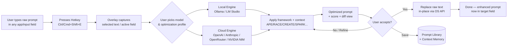
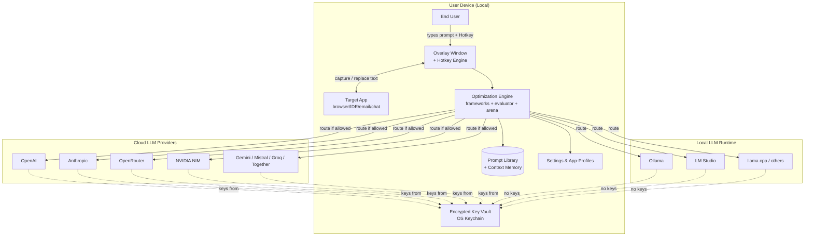

# Use Case Definition: Local Cross-Platform Prompt Optimization Overlay App

**Use Case ID:** UC-PO-001
**Use Case Name:** PromptOpt Overlay — Local, Multi-Provider Prompt Optimization Assistant
**Version:** 1.0 (Draft)
**Author:** Product Engineering
**Last Updated:** 2026-06-17
**Reference Products:** PromptPerfect by Jina AI, SiteGPT AI Prompt Optimizer, Prompt Genie

---

## 1. Executive Summary

A locally-installed, cross-platform desktop application that overlays any active input field, captures a user's raw prompt on a configurable global hotkey (default `Ctrl/Cmd + Shift + E`), routes it to a user-selected local or cloud LLM for optimization, and pastes the enhanced prompt back **in place** of the original — behaving like Grammarly for prompts. It unifies the framework-based rewriting of SiteGPT, the multi-model optimization and scoring of PromptPerfect, and the in-app, context-aware, library-driven workflow of Prompt Genie, while running entirely on the user's machine with user-chosen LLM backends.

---

## 2. Actors

| Actor | Type | Description |
|---|---|---|
| End User (Prompt Author) | Primary | Content creator, marketer, developer, or power user who writes prompts into any application. |
| LLM Provider (Local) | System | Ollama, LM Studio, llama.cpp server, KoboldCpp, Jan, GPT4All. |
| LLM Provider (Cloud) | System | OpenAI, Anthropic, OpenRouter, NVIDIA NIM, Google Gemini, Mistral, Groq, Together AI. |
| OS Accessibility Service | System | OS-level text-selection / field-control API used for in-place replacement. |
| Prompt Library Store | System | Local SQLite/JSON store of saved, tagged, reusable prompts and context profiles. |

---

## 3. Description

The app runs as a lightweight background process with a system-tray icon and an on-demand overlay window. When the user presses the configured hotkey while focused on (or with selected text in) any input field — browser textarea, IDE editor, email composer, native app textbox, terminal, or chat client — the overlay appears anchored near the cursor, pre-populated with the captured raw prompt. The user (or an auto-rule) selects an optimization framework, a target LLM, and any persistent context profile; the app calls the selected provider, returns a structured, enhanced prompt with a quality score and inline diff, and on confirmation replaces the original text in the active field via the OS accessibility / clipboard-simulation pipeline — no copy-paste required. All LLM traffic, keys, and history stay on the user's device unless explicitly routed to a cloud provider.

---

## 4. Goals & Success Metrics

**Goals (Business & User)**
1. Reduce the number of follow-up clarification turns per prompt by ≥60% (mirroring Prompt Genie's "1 send vs 5–10 exchanges" claim).
2. Provide framework-structured, model-aware optimization comparable to PromptPerfect's Auto-tune and SiteGPT's framework rewriting.
3. Operate fully offline with local models; zero telemetry by default.
4. Achieve Grammarly-grade in-place replacement reliability across ≥90% of common desktop input surfaces.

**Success Metrics**

| Metric | Target |
|---|---|
| Hotkey → overlay render latency | < 150 ms |
| Optimization round-trip (local 7B model) | < 3 s |
| Optimization round-trip (cloud frontier model) | < 5 s |
| In-place replacement success rate | ≥ 90% across tested apps |
| Prompt quality score uplift (vs raw) | ≥ 30% |
| User-customizable surface coverage | Themes, hotkey, frameworks, model routing, overlay position |
| Cross-platform parity | Feature parity on Windows, macOS, Linux |

---

## 5. Scope

**In Scope**
- Native desktop installers for Windows (10/11), macOS (Intel + Apple Silicon), and Linux (deb/rpm/AppImage).
- Overlay window rendered always-on-top, anchored to cursor/selection.
- Global hotkey capture with conflict detection (default `Ctrl/Cmd + Shift + E`).
- Text capture from active field / current selection via OS accessibility APIs.
- In-place replacement of raw prompt with optimized prompt.
- Pluggable LLM provider layer supporting local and cloud backends.
- Optimization frameworks (APE, TAG, RACE, CARE, RISE, ERA, CREATE, TRACE, ROSES, SPARK).
- Prompt Library with tagging, search, reuse.
- Context Memory / "Context Genie" — set role, audience, tone once, auto-injected.
- Prompt evaluator / scorer.
- Side-by-side multi-model testing — "Arena" mode.
- Theme engine, layout customization, plugin/extension hooks.
- Local-first settings, encrypted API-key vault, offline cache.

**Out of Scope (v1)**
- Mobile (iOS/Android) clients.
- Cloud-hosted SaaS version of the app itself.
- Browser extension variant (planned for v2).
- Fine-tuning / training custom models inside the app.
- Team collaboration server.

---

## 6. User Personas

1. **Prompt Novice ("casual creator")** — wants one-click optimization, defaults only, no jargon.
2. **Framework Power User ("prompt engineer")** — picks CREATE/TRACE/ROSES, edits templates, compares outputs across models.
3. **Privacy-First Developer** — runs Ollama / LM Studio locally, never sends data to cloud, customizes hotkeys.
4. **Enterprise Marketer** — persistent context profiles, shared prompt library, cloud frontier models for quality.

---

## 7. Preconditions

- Supported OS installed; user has admin/sudo rights for installer and accessibility permissions.
- Accessibility / input-monitoring permission granted (macOS Accessibility, Windows UIAutomation, Linux AT-SPI).
- At least one LLM provider configured (local daemon running, or API key entered).
- Overlay & global-shortcut permissions granted on first launch.
- Hotkey not already bound by another global app (conflict detector runs on startup).

---

## 8. Triggers

| Trigger | Description |
|---|---|
| **Primary: Global Hotkey** | `Ctrl/Cmd + Shift + E` (configurable) pressed while focus is in any text-capable field. |
| Secondary: Tray Menu | "Optimize clipboard" action from system-tray icon. |
| Secondary: Overlay Floating Button | Persistent mini-button that expands overlay (optional mode). |
| Tertiary: CLI / IPC | `promptopt optimize --text "..." --model ollama:llama3` for power users. |

---

## 9. Main Success Scenario (MSS)

1. User opens any application with a text input (e.g., ChatGPT web, VS Code, Outlook, Slack, a browser textarea).
2. User types or selects a raw prompt: *"write marketing copy for headphones"*.
3. User presses `Ctrl/Cmd + Shift + E`.
4. App captures the selected text (or full field content if none selected) and detects the active field's caret position via the OS accessibility API.
5. Overlay window renders within 150 ms, anchored near the caret, showing: captured raw prompt, framework selector, target-model selector, context-profile chip, and an "Optimize" button.
6. User presses Enter (or clicks Optimize). App builds a meta-prompt using the selected framework + context profile + raw prompt, and calls the selected LLM provider.
7. Provider returns an optimized prompt. App displays: enhanced text, quality score, inline diff vs raw, token estimate, and "Accept / Refine / Try Another Model / Save to Library" actions.
8. User clicks **Accept** (or presses `Enter`).
9. App replaces the raw text in the original active field in-place — programmatically focusing the field, selecting the prior range, and inserting the enhanced text.
10. Overlay auto-dismisses; user continues in the target app with the enhanced prompt now in place.
11. Optimization is logged to local history; if "auto-save winners" is on, prompt is added to the Library.

---

## 10. Alternate Flows

- **A1 — No text selected / empty field:** Overlay opens with an empty editor; user types directly into overlay, optimizes, then "Insert into active field" places result at caret.
- **A2 — Field not replaceable (read-only / canvas / web SPA):** App falls back to copying enhanced prompt to clipboard and showing a toast "Pasted to clipboard — press Ctrl/Cmd+V".
- **A3 — Provider unreachable / model error:** Overlay shows inline error with retry, model switcher, and "Use last cached result" option.
- **A4 — User chooses Refine:** App loops the meta-prompt with user's edit notes and re-optimizes; supports N refinement rounds.
- **A5 — User chooses Try Another Model (Arena):** Runs the same raw prompt through 2–4 selected models in parallel and presents results side-by-side with scores.
- **A6 — Hotkey conflict detected:** On launch or settings change, app warns "Ctrl+Shift+E is used by [App X]" and suggests alternatives.
- **A7 — Local model not running:** Auto-detect Ollama (11434) / LM Studio (1234); if down, offer "Start local server" button or fall back to a cloud provider.
- **A8 — Privacy guard for cloud:** If a context profile or raw prompt contains text matching a user-defined regex blocklist, app blocks cloud routing and forces local-only.

---

## 11. Functional Requirements

### 11.1 Overlay & Interaction
- **FR-O1** Always-on-top, borderless, themeable overlay window; position follows caret or selection with edge-aware placement.
- **FR-O2** Configurable hotkey via globalShortcut; default `Ctrl/Cmd + Shift + E`.
- **FR-O3** Multi-monitor aware; remembers last position per monitor per app-profile.
- **FR-O4** Overlay supports keyboard-only navigation (Tab, Enter, Esc, arrows).
- **FR-O5** Mini-mode (compact) and full-mode (with library, arena, settings) toggle.

### 11.2 Text Capture & In-Place Replacement
- **FR-T1** Capture selected text; if none, capture active field value via accessibility tree.
- **FR-T2** Replace text in active field using, in priority order: (a) native accessibility `setText`/`setValue`, (b) simulated select-all + paste with clipboard backup/restore, (c) synthetic keyboard input.
- **FR-T3** Preserve caret position and undo stack where the target control supports it.
- **FR-T4** Maintain an "app-profile" registry of known apps with per-app replacement strategy overrides.
- **FR-T5** Per-app opt-out blocklist (e.g., password managers, banking sites).

### 11.3 LLM Provider Integration
- **FR-L1** Unified provider abstraction with adapter pattern: `chat(messages, params) -> response`.
- **FR-L2** Local providers: Ollama, LM Studio, llama.cpp server, KoboldCpp, Jan, GPT4All.
- **FR-L3** Cloud providers: OpenAI, Anthropic, OpenRouter, NVIDIA NIM, Google Gemini, Mistral, Groq, Together AI.
- **FR-L4** Streaming responses with progressive overlay update.
- **FR-L5** Per-provider model listing.
- **FR-L6** Per-provider config: endpoint, API key (encrypted at rest), timeout, max tokens, temperature, system prompt.
- **FR-L7** Provider health-check with latency probe; auto-disable dead providers.
- **FR-L8** Routing rules: "use local for short prompts, cloud for long", "prefer provider X for code, Y for marketing".

### 11.4 Optimization Engine
- **FR-E1** Built-in framework templates: APE, TAG, RACE, CARE, RISE, ERA, CREATE, TRACE, ROSES, SPARK.
- **FR-E2** User-editable framework templates (Jinja/Mustache) with variables.
- **FR-E3** Optimization modes: *Quick* (single-pass rewrite), *Auto-tune* (iterative refinement with self-critique), *Arena* (multi-model parallel), *Interactive* (conversational refinement).
- **FR-E4** Output structure: enhanced prompt + rationale + quality score (0–100) + token estimate + diff.
- **FR-E5** Prompt evaluator: scores raw and optimized prompts on clarity, specificity, structure, completeness.
- **FR-E6** Few-shot injection: optional examples pulled from the Library by tag-match.

### 11.5 Prompt Library & Context Memory
- **FR-P1** Local store (SQLite) of prompts with: title, body, tags, framework, model used, score, usage count, last-used, source-app.
- **FR-P2** Full-text search; filter by tag/framework/model; sort by score/usage/recency.
- **FR-P3** Context profiles ("Context Genie"): persistent role/audience/tone/format/style snippets auto-prepended to every optimization.
- **FR-P4** Import/export library as JSON or Markdown.
- **FR-P5** Optional v1.1 share-via-link (local file or signed payload).

### 11.6 Customization
- **FR-C1** Theme engine (light/dark/system + custom CSS), accent color, overlay opacity, blur, rounded corners, font.
- **FR-C2** Hotkey editor with conflict detection and per-action bindings.
- **FR-C3** Default framework, default model, default context profile per app-profile.
- **FR-C4** Overlay size presets (mini/standard/wide) and persist-as-pin option.
- **FR-C5** Plugin manifest (v1.1): custom framework packs, custom provider adapters, custom post-processors.

### 11.7 Security & Privacy
- **FR-S1** All settings, history, keys stored locally; API keys encrypted with OS keychain.
- **FR-S2** Telemetry off by default; no analytics unless explicitly enabled.
- **FR-S3** PII/secret regex blocklist before cloud routing.
- **FR-S4** Optional "cloud denylist" — global toggle to restrict to local providers only.
- **FR-S5** Conversation/history retention policy with auto-purge.

---

## 12. Non-Functional Requirements

| Category | Requirement |
|---|---|
| Performance | Overlay render < 150 ms; local optimization < 3 s; cold start < 1.5 s; idle RAM < 120 MB. |
| Reliability | In-place replacement ≥ 90% success across a curated test suite of 50+ apps; graceful degradation to clipboard. |
| Portability | Single codebase via Tauri (Rust + WebView) preferred; Electron as fallback. Identical feature set on Windows/macOS/Linux. |
| Security | OS-keychain key storage; no outbound traffic except to user-configured provider endpoints; signed updates. |
| Privacy | Local-first; zero telemetry default; clear per-request "local vs cloud" indicator in overlay. |
| Accessibility | Full keyboard nav; screen-reader labels (ARIA in WebView); respects OS reduced-motion. |
| Maintainability | Provider adapters as isolated modules behind a trait/interface; framework templates as data, not code. |
| Compatibility | Windows 10+, macOS 11+, Ubuntu 22.04+/Fedora 38+. |
| Packaging | MSI/EXE (Windows), DMG (macOS, notarized), deb/rpm/AppImage (Linux); auto-update channel. |

---

## 13. LLM Provider Integration Matrix

| Provider | Type | Protocol | Auth | Model Discovery | Streaming | Notes |
|---|---|---|---|---|---|---|
| Ollama | Local | `/api/chat` (native) + `/v1/chat/completions` | None | `/api/tags` | Yes | Default local recommendation. |
| LM Studio | Local | OpenAI-compatible `/v1/...` | None (optional key) | `/v1/models` | Yes | Local server on :1234. |
| llama.cpp server | Local | OpenAI-compatible | None | `/v1/models` | Yes | For advanced users. |
| OpenAI | Cloud | `/v1/chat/completions` | Bearer key | hardcoded + `/v1/models` | Yes | GPT-4o, o-series. |
| Anthropic | Cloud | `/v1/messages` | `x-api-key` | hardcoded | Yes | Claude 3.5/4 family. |
| OpenRouter | Cloud | OpenAI-compatible | Bearer key | `/v1/models` | Yes | Aggregates 200+ models. |
| NVIDIA NIM | Cloud | OpenAI-compatible | Bearer key | `/v1/models` | Yes | Self-hosted NIM endpoints. |
| Google Gemini | Cloud | Generative Language API | API key | list endpoint | Yes | Gemini 1.5/2.x. |
| Mistral | Cloud | OpenAI-compatible | Bearer key | `/v1/models` | Yes | EU-hosted option. |
| Groq | Cloud | OpenAI-compatible | Bearer key | `/v1/models` | Yes | Ultra-low latency. |
| Custom | Any | OpenAI-compatible URL | Bearer key (opt) | `/v1/models` | Yes | User-defined endpoint. |

---

## 14. Overlay & Hotkey Interaction Specification

**Hotkey:** Default `Ctrl + Shift + E` (Windows/Linux), `Cmd + Shift + E` (macOS). Registered globally. User-editable; supports chord and modifier combinations; conflict detector queries OS-registered shortcuts and warns.

**Overlay lifecycle:**
1. Hotkey → capture active field/selection (≤50 ms).
2. Show overlay anchored to caret, fade-in 80 ms.
3. Pre-fill raw prompt; default framework + model + context auto-selected per app-profile.
4. `Enter` triggers optimize; `Shift+Enter` inserts newline; `Esc` cancels and refocuses original field.
5. Result panel: enhanced prompt (editable), score chip, diff toggle, token count, model badge.
6. Actions: `Enter` = Accept & Replace in-place; `Ctrl/Cmd+R` = Refine; `Ctrl/Cmd+M` = Switch model; `Ctrl/Cmd+S` = Save to Library; `Ctrl/Cmd+Shift+A` = Arena.

**In-place replacement pipeline:** detect target control type → choose strategy (accessibility setValue → clipboard-paste-with-restore → synthetic keystrokes) → execute → verify by re-reading field → toast confirmation or fallback to clipboard.

---

## 15. Customization & Settings

- **Appearance:** theme (light/dark/system + custom CSS), accent, opacity, blur, corner radius, font family/size, overlay position rule (caret / last / fixed).
- **Hotkeys:** per-action bindings, conflict detection, enable/disable per action.
- **Models:** provider list with enable/disable, default per app-profile, routing rules, latency thresholds.
- **Frameworks:** enable/disable built-ins, edit templates, import framework packs.
- **Context profiles:** create/edit/delete, assign to app-profiles or global default.
- **Privacy:** telemetry toggle, cloud allow/deny, PII regex blocklist, history retention.
- **App-profiles:** per-application rules (override framework/model/context/replacement-strategy).
- **Updates:** channel selector (stable/beta), auto-update toggle.
- **Backup:** export/import all settings + library as encrypted bundle.

---

## 16. Use Case / Context Diagram

---

## 17. Assumptions

- User has administrative rights to grant accessibility/input-monitoring permissions on first run.
- Local LLM runtimes (Ollama/LM Studio) expose OpenAI-compatible or native REST endpoints on localhost.
- Target applications expose text via OS accessibility APIs or accept synthetic input; web apps are addressed via the rendered DOM accessible node.
- Cloud providers' APIs remain backward-compatible with documented endpoints.
- Single-user-per-machine model; multi-user OS sessions are out of scope for v1.

---

## 18. Risks & Mitigations

| Risk | Impact | Mitigation |
|---|---|---|
| In-place replacement fails on certain web SPAs / canvas apps | UX degradation | App-profile registry + clipboard fallback + community-reported app-profile updates. |
| OS restricts global hotkeys / accessibility | Feature blocked | Ship notarized build with UIAccess manifest; guide user through permission grants. |
| Hotkey collision with popular apps | Conflicts | Conflict detector on startup + per-app override. |
| Local model latency on low-end hardware | Slow optimization | Streaming + "Quick" mode + model-size recommendation engine. |
| Cloud key leakage | Security | OS keychain encryption; never log keys; redact in error reports. |
| Overlay steals focus from target field | Replacement fails | Use non-activating always-on-top window; restore focus before replacement. |
| Provider API changes | Broken integration | Adapter versioning + community adapter packs. |
| Prompt injection in optimization meta-prompt | Untrusted output | Sanitize raw prompt; mark injected boundaries; user reviews before insert. |

---

## 19. Open Questions

1. Should the app ship a bundled lightweight local model for zero-config offline optimization, or require the user to install Ollama first?
2. Browser-extension companion — same codebase via WebView2 injection or separate extension in v2?
3. Team sync of prompt library — local-folder sync (Dropbox/Drive) vs. optional self-hosted sync server?
4. Should the Arena mode persist runs as evaluation datasets for future fine-tuning of routing rules?
5. Licensing model: fully open-source (MIT/Apache) vs. source-available freemium?

---

## 20. References to Source Products

- **PromptPerfect (Jina AI)** — Auto-tune, Arena, Prompt-as-a-Service, Agents, multi-model switching, scoring/feedback.
- **SiteGPT AI Prompt Optimizer** — framework-based rewriting (APE, TAG, RACE, CARE, RISE, ERA, CREATE, TRACE, ROSES, SPARK) with target-framework selection.
- **Prompt Genie** — in-app overlay inside ChatGPT/Claude/Gemini, one-click optimize, Context Genie (persistent context), Prompt Library, prompt evaluator, side-by-side multi-model testing.
- **Tauri Global Shortcut plugin** — cross-platform hotkey registration reference.
